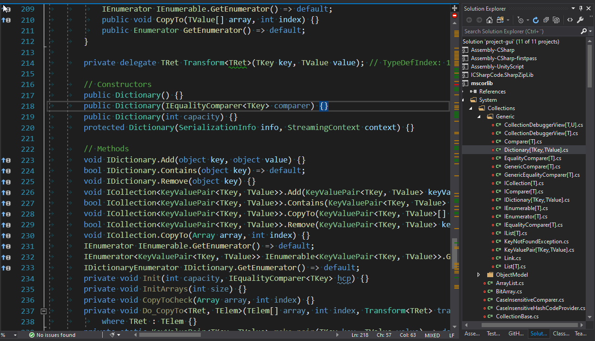
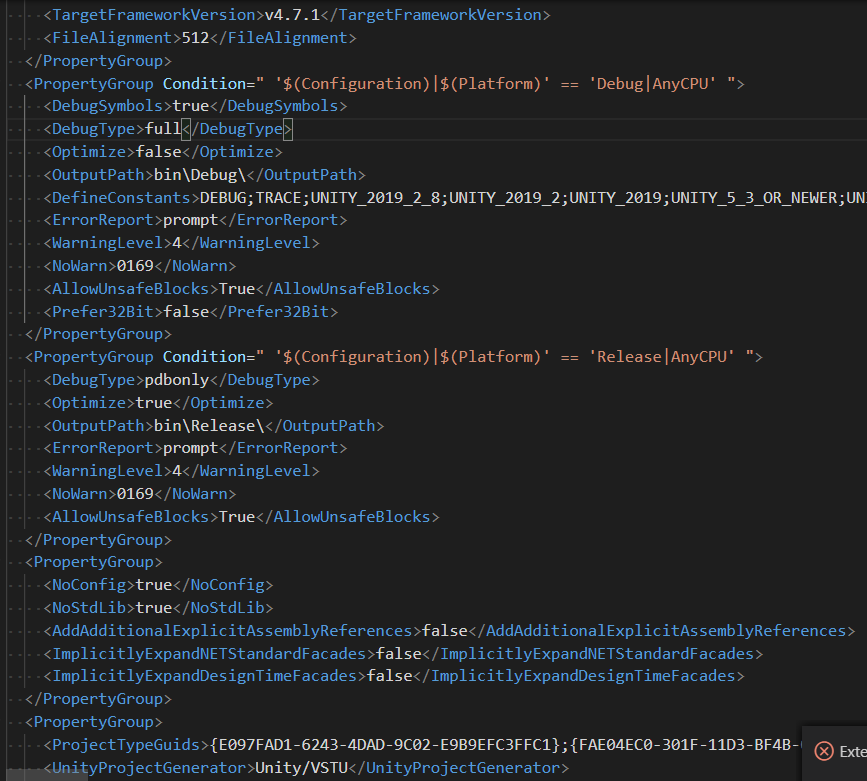

# Il2CppInspector

Il2CppInspector helps you to reverse engineer IL2CPP applications in Windows or from the Windows, MacOS X or Linux command line.

**No manual reverse-engineering is required; all data is calculated automatically.**


Main features:

* Output IL2CPP metadata and method pointers as C# stub code



* Create Visual Studio solutions directly from IL2CPP files



* Create IDA Python scripts to populate symbol and function information


File format and architecture support:

* Supports ELF (Android .so), PE (Windows .exe), Mach-O (Apple iOS/Mac) and Universal Binary (Fat Mach-O) file formats
* 32-bit and 64-bit support for all file formats
* Supports ARMv7, Thumb-2, ARMv8 (A64), x86 and x64 architectures regardless of file format
* Supports applications created with Unity 5.3.0 onwards (full IL2CPP version table below)

Nice to have:

* Support for assemblies, classes, methods, constructors, fields, properties, enumerations, events, interfaces, structs, pointers, references, attributes, nested types, generic types, generic methods, generic constraints, default field values and default method parameter values
* C# syntactic sugar for CTS value types, compiler-generated types, delegates, extension methods, operator overloading, indexers, user-defined conversion operators, explicit interface instantiations, finalizers, nullable types, unsafe contexts, fixed-size arrays, variable length argument lists, method hiding and escaped strings
* Partition C# code output by namespace, assembly, class, full tree or single file; sort by index or type name; output flat or nested folder hierarchy. Each file includes the necessary `using` directives. Scope and type name conflicts are resolved automatically to produce code that compiles.
* Static and dynamic symbol table scanning and relocation processing for ELF binaries 
* Static symbol table scanning for Mach-O binaries
* Automatically defeats certain basic obfuscation methods

Reusable class libraries:

* **Il2CppInspector** for low-level access to IL2CPP binaries and metadata
* **Il2CppModel** for high-level .NET Reflection-style access to IL2CPP types and data as a tree model
* Test chassis for automated integration testing of IL2CPP binaries

Class library targets .NET Standard 2.1. Application targets .NET Core 3.0. Built with Visual Studio 2019.

NOTE: **Il2CppInspector is not a decompiler!** It cannot take an executable file and regenerate all of the source code for you. The output includes function pointers to each method so that you can quickly locate the methods of interest in a disassembler.

### Build instructions

```
git clone --recursive https://github.com/djkaty/Il2CppInspector
cd Il2CppInspector
dotnet publish -c Release
```

This will build Il2CppInspector for Windows 64-bit. For MacOS and Linux, add  `-r xxx` to the final command where `xxx` is a RID from https://docs.microsoft.com/en-us/dotnet/articles/core/rid-catalog

The output binary for command-line usage is placed in `Il2CppInspector/Il2CppInspector.CLI/bin/Release/netcoreapp3.0/win-x64/publish/Il2CppInspector.exe`.

The output binary for Windows GUI is places in `Il2CppInspector/Il2CppInspector.GUI/bin/Release/netcoreapp3.1/win-x64/publish/Il2CppInspector.exe`.

### Command-line Usage

Run `Il2CppInspector.exe` at the command prompt.

File format and architecture are automatically detected.

```
  -i, --bin                   (Default: libil2cpp.so) IL2CPP binary file input
  -m, --metadata              (Default: global-metadata.dat) IL2CPP metadata file input
  -c, --cs-out                (Default: types.cs) C# output file (when using single-file layout) or path (when using per namespace, assembly or class layout)
  -p, --py-out                (Default: ida.py) IDA Python script output file
  -e, --exclude-namespaces    (Default: System Unity UnityEngine UnityEngineInternal Mono Microsoft.Reflection Microsoft.Win32 Internal.Runtime AOT JetBrains.Annotations) Comma-separated list of namespaces to suppress in C# output, or 'none' to include all namespaces
  -l, --layout                (Default: single) Partitioning of C# output ('single' = single file, 'namespace' = one file per namespace in folders, 'assembly' = one file per assembly, 'class' = one file per class in namespace folders, 'tree' = one file per class in assembly and namespace folders)
  -s, --sort                  (Default: index) Sort order of type definitions in C# output ('index' = by type definition index, 'name' = by type name). No effect when using file-per-class or tree layout
  -f, --flatten               Flatten the namespace hierarchy into a single folder rather than using per-namespace subfolders. Only used when layout is per-namespace or per-class. Ignored for tree layout
  -n, --suppress-metadata     Diff tidying: suppress method pointers, field offsets and type indices from C# output. Useful for comparing two versions of a binary for changes with a diff tool
  -k, --must-compile          Compilation tidying: try really hard to make code that compiles. Suppress generation of code for items with CompilerGenerated attribute. Comment out attributes without parameterless constructors or all-optional constructor arguments. Don't emit add/remove/raise on events. Specify AttributeTargets.All on classes with AttributeUsage attribute. Force auto-properties to have get accessors. Force regular properties to have bodies. Suppress global::Locale classes.
      --separate-attributes   Place assembly-level attributes in their own AssemblyInfo.cs files. Only used when layout is per-assembly or tree
  -j, --project               Create a Visual Studio solution and projects. Implies --layout tree, --must-compile and --separate-attributes
      --unity-path            (Default: C:\Program Files\Unity\Hub\Editor\*) Path to Unity editor (when using --project). Wildcards select last matching folder in alphanumeric order
      --unity-assemblies      (Default: C:\Program Files\Unity\Hub\Editor\*\Editor\Data\Resources\PackageManager\ProjectTemplates\libcache\com.unity.template.3d-*\ScriptAssemblies) Path to Unity script assemblies (when using --project). Wildcards select last matching folder in alphanumeric order
```

Defaults if not specified:

- _bin_ - `libil2cpp.so`
- _metadata_ - `global-metadata.dat`
- _cs-out_ - `types.cs`
- _py-out_ - `ida.py`

To exclude types from certain namespaces from being generated in the C# source file output, provide a comma-separated list of case-sensitive namespaces in `--exclude-namespaces`. The following namespaces will be excluded if no argument is specified:

```
System
Mono
Microsoft.Reflection
Microsoft.Win32
Internal.Runtime
Unity
UnityEditor
UnityEngine
UnityEngineInternal
AOT
JetBrains.Annotations
```

Providing an argument to `--exclude-namespaces` will override the default list. To output all namespaces, use `--exclude-namespaces=none`.

For Apple Universal Binaries, multiple output files will be generated, with each filename besides the first suffixed by the index of the image in the Universal Binary. Unsupported images will be skipped.

### Adding metadata to your IDA workflow

Simply run Il2CppInspector with the `-p` switch to choose the IDA script output file. Load your binary file into IDA, press Alt+F7 and select the generated script. Observe the Output Window while IDA analyzes the file - this may take a long time.

Il2CppInspector generates the following data for IDA projects:

- Names for all regular .NET methods
- Names for all constructed generic methods
- Names for all IL2CPP custom attributes generator functions
- Names, .NET argument type lists and C++ signatures for all IL2CPP runtime invoker functions for both regular and constructed generic methods (per-signature Method.Invoke endpoints)
- Function boundaries for all of the above
- Comments at each function entry point with .NET method signatures for all of the above
- Names for all of the following IL metadata references: Type, TypeInfo, MethodDef, FieldInfo, StringLiteral, MethodRef (this includes all generic class and method instantiation metadata)
- Comments for all IL string literal metadata pointers containing the value of the string
- Names for some IL2CPP-specific data structures and functions

### Creating a Visual Studio solution

Il2CppInspector can create a complete Visual Studio workspace with a solution (.sln) file, project (.csproj) files and assembly-namespace-class tree-like folder structure. Each project creates a single assembly.

Use the `--project` flag to generate a solution workspace.

In order for Il2CppInspector to be able to create .csproj files which contain the correct Unity assembly references, you must provide the path to an installed Unity editor and a project template or `ScriptAssemblies` folder of an existing Unity project.

NOTE: The default settings will select the latest installed version of Unity and the latest installed version of the default 3D project template, if they have been installed in the default location.

Typical Unity editor location (specified with `--unity-path`): *C:\Program Files\Unity\Hub\Editor\20xx.y.z*

Typical Unity project template location (specified with `--unity-assemblies`): *C:\Program Files\Unity\Hub\Editor\20xx.y.z\Editor\Data\Resources\PackageManager\ProjectTemplates\libcache\\\<name-of-template>*

Typical Unity script assemblies location in existing project (specified with `--unity-aseemblies`): *X:\MyProject\Library\ScriptAssemblies*

Replace *x*, *y* and *z* with your Unity version number. Replace *\<name-of-template\>* with the desired template.

NOTE: You can use the asterisk wildcard (*) one or more times when specifying these paths. Il2CppInspector will select the last matching folder in alphanumeric order. This is useful if you have multiple side-by-side Unity installs and wish to always select the latest version or template.

In the event that the assembly references are not correctly resolved the first time you load a solution, simply close and re-open the solution to force them to be resolved.

### Class library

To utilize Il2CppInspector in your own programs, add a reference to `Il2CppInspector.Common.dll` and add a using statement for the namespace `Il2CppInspector.Reflection`. See the source code for further details.

### Running tests

Two Powershell scripts are provided to enable easy testing and debugging:

* `generate-binaries.ps1` compiles every C# source file in `TestSources` as a separate assembly and outputs them to `TestAssemblies`. It then takes every assembly in `TestAssemblies` and compiles each one as a separate IL2CPP project twice: one for Windows x86 standalone and one for Android into the `TestBinaries`folder. It then calls `generate-tests.ps1`.
* `generate-tests.ps1` generates a file called `Tests.cs` in the `Il2CppTests` project, containing one test per IL2CPP project in `TestBinaries`. This file will be compiled by the `Il2CppTests`project. You will then be able to see one test per IL2CPP project in Visual Studio's Test Explorer.

The auto-generated tests generate a file in the test IL2CPP binary's folder called `test-result.cs` and compares it (whitespace-insensitive) with the corresponding project name `cs` file in `TestExpectedResults`. In this way, you can check for files with known structure that the analysis is being performed correctly, or step through the analysis of specific binaries in the debugger without having to change the project's command-line arguments.

### Version support

Unity version | IL2CPP version | Support
--- | --- | ---
4.6.1+ | First release | Unsupported
5.2.x | 15 | Unsupported
5.3.0-5.3.1 | 16 | Working
5.3.2 | 19 | Untested
5.3.3-5.3.4 | 20 | Untested
5.3.5-5.4.x | 21 | Working
5.5.x | 22 | Working
5.6.x | 23 | Working
2017.x-2018.2 | 24.0 | Working
2018.3-2019.x | 24.1 | Working
2019.x+ | 24.2 | Working

### Problems

If you have files that don't work or are in an unsupported format, please open a new issue on GitHub and attach a sample with details on the file format, and I'll try to add support. Include both the IL2CPP binary and `global-metadata.dat` in your submission.

Please check the binary file in a disassembler to ensure that it is a plain IL2CPP binary before filing an issue. Il2CppInspector is not intended to handle packed, encrypted or obfuscated IL2CPP files.

### Support

If you found Il2CppInspector useful, you can really help support the project by making a small donation at http://paypal.me/djkaty!

You can also donate with bitcoin: 3FoRUqUXgYj8NY8sMQfhX6vv9LqR3e2kzz

Much love! - Katy

### Acknowledgements

Thanks to the following individuals whose code and research helped me develop this tool:

- Perfare - https://github.com/Perfare/Il2CppDumper
- Jumboperson - https://github.com/Jumboperson/Il2CppDumper
- nevermoe - https://github.com/nevermoe/unity_metadata_loader
- branw - https://github.com/branw/pogo-proto-dumper
- fry - https://github.com/fry/d3
- ARMConverter - http://armconverter.com
- Defuse - https://defuse.ca/online-x86-assembler.htm

The following books were also very helpful:

- [Practical Reverse Engineering](https://www.amazon.com/Practical-Reverse-Engineering-Reversing-Obfuscation/dp/1118787315/ref=sr_1_1?keywords=practical+reverse+engineering&qid=1580952619&sr=8-1) by Bruce Dang
- [Expert .NET 2.0 IL Assembler](https://www.amazon.com/Expert-NET-Assembler-Serge-Lidin/dp/1590596463/ref=sr_1_6?keywords=expert+il+2.0&qid=1580952700&sr=8-6) by Serge Lidin
- [The IDA Pro Book, 2nd Edition](https://www.amazon.com/IDA-Pro-Book-Unofficial-Disassembler/dp/1593272898/ref=sr_1_1?keywords=ida+pro+book&qid=1580952729&sr=8-1) by Chris Eagle
- [The Beginner's Guide to IDAPython](https://leanpub.com/IDAPython-Book) by Alexander Hanel

Pizza spinner animation in the GUI made by Chris Gannon - https://gannon.tv/

### License

This software is licensed under AGPLv3.
